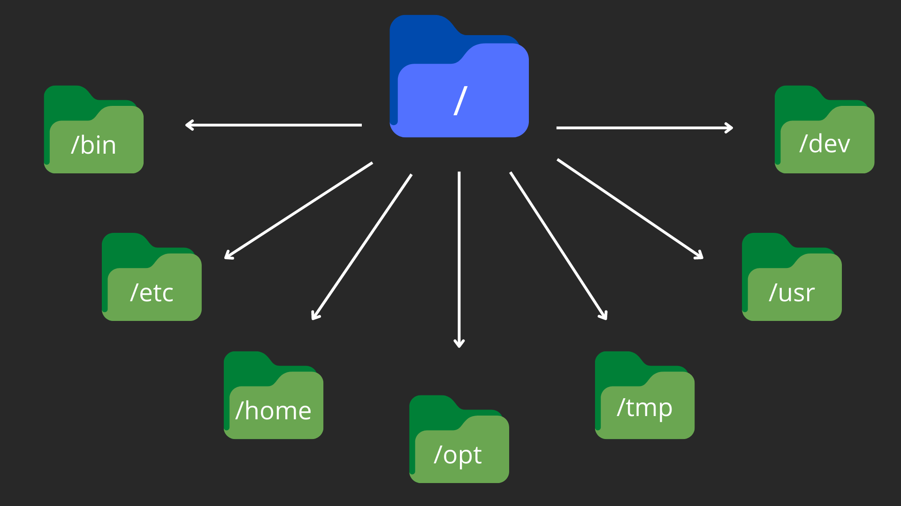
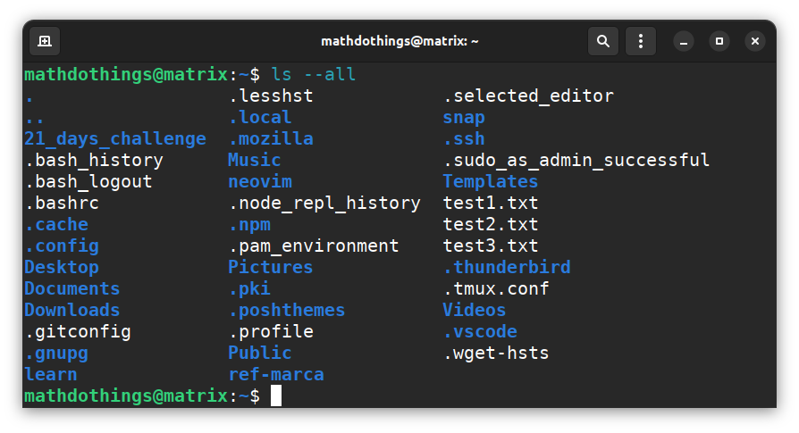

# Uso Básico do Terminal

O _terminal_ é uma das ferramentas mais utilizadas quando estamos desenvolvendo alguma aplicação. Ele consegue nos fornecer várias maneiras **mais rápidas** de fazer atividades mais triviais como criar, apagar ou renomear arquivos e diretórios. Portanto, é necessário aprender suas funcionalidades mais básicas e, aos poucos, irmos incrementando nossos aprendizados. Neste guia irei mostrar o uso mais básico do terminal e os comandos mais usados no cotidiano, além de algumas técnicas que agilizam seu uso.

Antes de começarmos, precisamos entender dois fatores importantes.

1. Quando mencionamos a palavra **terminal**, estamos falando, geralmente, do _shell_, que é a aplicação que nos fornece os comandos e utilidades. Na maioria das distribuições Linux, o terminal (ou seja, o _shell_) utilizado por padrão é o **Bash**.

2. Diferente do _shell_, terminal também pode referir ao **emulador de terminal**, que é basicamente o ambiente onde o _shell_ está executando. Na maioria das distribuições Linux, o emulador de terminal depende do _desktop-enviroment_, que de maneira mais leiga podemos dizer que é o ambiente do sistema operacional. Por padrão, na maioria das distribuições Linux, o _desktop-enviroment_ é o **GNOME**, e o emulador de terminal é o **gnome-terminal**. Se o ambiente for **KDE**, o emulador de terminal será o **Konsole**.
3. É importantes frizar que o emulador é apenas o ambiente onde o shell está sendo executado, e, geralmente, ele não interfere muito nas situações de uso cotidiano. Ele não altera qual é o shell utilizado, o **Bash** pode ser executado em ambos **gnome-terminal** ou **Konsole**.

**Resumo:** **_shell_** é o conjunto de funcionalidades e comandos, **_emulador de terminal_** é onde esse shell está sendo 'emulado' ou executado.

**_É primordial entender essa diferença pois essa terminologia muitas vezes confunde quem está iniciando sua jornada com o uso do terminal._**

## Atalhos (Shortcuts)

- **Tab Completion** <kbd>Tab</kbd>

  - Trata-se de utilizar o recurso de **autocomplete** do shell, ou seja, digitamos apenas uma parte do comando ou funcionalidade e apertamos a tecla <kbd>Tab</kbd> e o terminal completa o restante do comando/funcionalidade.

  ***

- **clear** <kbd>CTRL</kbd> + <kbd>L</kbd>

  - Podemos digitar o comando **clear** para limpar a tela do terminal. Lembrando que esse comando não limpa realmente o histórico de comandos ou os comandos digitados, ele apenas dará um **scrollup** em tudo que está na tela do terminal e deixar a tela "limpa". Esse comando é muito utilizado e, por isso, ele tem um atalho próprio que na maioria dos emuladores é o <kbd>CTRL</kbd> + <kbd>L</kbd>.

  ***

- **cancel** <kbd>CTRL</kbd> + <kbd>C</kbd>

  - Quando digitamos um comando e ele **está sendo executado**, se quisermos **cancelar** a execução do mesmo, podemos apertar <kbd>CTRL</kbd> + <kbd>C</kbd>.

---

- **done** <kbd>CTRL</kbd> + <kbd>D</kbd>

  - Quando digitamos um comando e **ele está sendo executado**, se quisermos **finalizar** a execução do mesmo, podemos apertar <kbd>CTRL</kbd> + <kbd>D</kbd>. Diferente de cancelar, este atalho apenas informa ao shell que não queremos mais realizar posteriores operações neste comando, portanto, pode finalizar a tarefa. Caso nenhum comando específico esteja sendo executado, esse atalho irá fechar o terminal.

  ***

- <kbd>&darr;</kbd> e <kbd>&uarr;</kbd>

  - Tudo que digitamos no terminal fica guardado em um histórico próprio. Para acessá-lo, entre outras formas, usamos as teclas <kbd>&darr;</kbd> e <kbd>&uarr;</kbd> do teclado.

  ***

## Diretórios

Antes de proseguirmos, irei explicar um pouco sobre **diretório** ou **directory**, em inglês. Um diretório é, de forma simples, um local onde podemos armazenar arquivos ou outros subdiretórios, é o equivalente a uma **pasta** em um ambiente gráfico. Daqui em diante passarei a utilizar o termo **directory/subdirectory** ao invés de **diretório/subdiretório**. Ou seja, quando mencionar directory estou me referindo a uma pasta, e, o mesmo para subdirectory, uma subpasta. Vamos entender um pouco a hierarquia de diretórios do Linux.

Diferente do _Windows_ onde os dispositivos são representados por letras como **C** ou **D**, no Linux, os diretórios são separados em uma certa hierarquia, a **F**ilesystem **H**ierarchy **S**tandard **(FHS)**. A FHS define um padrão para a estrutura dos diretórios. Abaixo podemos ver uma imagem que ilustra um pouco dessa estrutura.

Não vou entrar em detalhes sobre cada sub directory pois esse não é o intuito deste guia.  
O importante a entender aqui é que a <kbd>/</kbd> _(barra)_ representa o **root** direcotry, em outras palavras, a raíz de todos os directories do sistema.

A maioria dos dados do seu usuário, por exemplo, ficam dentro do sub directory <kbd>/home</kbd> e a maioria dos binários (os programas que executados, ou executados pelo sistema) mais importantes ficam em <kbd>/bin</kbd>. Já o equivalente aos dispositivos (_devices_) **C** ou **D** do Windows, ficam em <kbd>/dev</kbd>.

## Entendendo a tela inicial

Geralmente, quando iniciamos uma nova aplicação shell, vemos o seguinte:

Como o espaço disponível para mostrar informações é muito limitado, em geral, os terminais optam por mostrar certos elementos ou símbolos que significam algo específico. Vamos entender melhor cada elemento exibido.

1. `mathdothings` ⇒ nome do **usuário** ou **user**, inglês;

2. <kbd>@</kbd> ⇒ símbolo utilizado para indentificar que esse usuário está utilizando o **hostname**, que geralmente é o nome do computador, como se fosse _mathdothings está utilizando o computador matrix_, onde matrix foi o nome que eu defini para o meu computador;

3. `matrix` ⇒ nome do **hostname** ou nome do computador;

4. <kbd>:</kbd> _(dois pontos / colon, em inglês)_ ⇒ símbolo utilizado para separar o hostname do working directory, ou seja, do diretório atual;

5. <kbd>~</kbd> _(til / tilde, em inglês)_ ⇒ símbolo utilizado para representar o **home** directory do user. **~** e **/home/\<user\>** são equivalentes. Lembre-se que \<user\> deve ser substituído pelo nome do usuário, sem os \< \>. **Ex.:** `/home/mathdothings`;

6. <kbd>$</kbd> _(prompt)_ ⇒ símbolo utilizado para indicar que podemos executar comandos. Sempre que um comando for resolvido ou abrirmos uma nova aplicação shell, esse símbolo irá aparecer como sinal que outros comandos já podem ser inseridos.

Deixei os nomes de alguns símbolos em inglês para referêcia, pois é muito comum expressões como _colon separator_, _tilde directory_ ou _command prompt_.

## Comandos (Commands)

Nos exemplos abaixo estou utilizando o **Bash** no **gnome-terminal**.

* **Obs.:** _Para sair do shell a qualquer momento, basta apertar_ <kbd>CTRL + D</kbd> _ou dititar_ <kbd>exit</kbd> _e apertar_ <kbd>ENTER</kbd>.

Utilizar comandos no terminal é muito simples, basta digitar o comando e apertar <kbd>ENTER</kbd>.

Perceba que digitei `pdw` no terminal. Esse comando é um acrônimo para \"**p**rint **w**orking **d**irectory\". Em outras palavras, ele simplesmente mostra em qual **diretório** estamos.

#### Bandeiras (Flags)

As **flags** são parâmetros que podemos passar para os comandos, modificando um pouco sua funcionalidade. Elas podem aparecer de duas formas, uma mais curta e outra mais longa e cada uma têm suas características. A forma curta é ideal para executar **vários argumentos**. Já a forma longa só funciona com alguns argumentos e geralmente só é utilizado para fornecer **um único** parâmetro pois a forma longa é mais trabalhosa de se digitar. Abaixo ilustrarei melhor como utilizar as flags.

## ls - listar (list)

O comando **ls** é bem simples, ele apenas mostra ou lista o contéudo de um directory. Se utilizarmos ele sem um **path** específico, ele mostra o conteúdo do directory atual.

_\*Em um guia posterior irei explicar mais sobre path_.

Como você pode ver, estou no directory <kbd>/home/\<username\></kbd> ou simplesmente **home** e a imagem mostra o resultado do comando **ls**. Podemos ver que o terminal, no meu caso, exibe os directories em cor azul e o arquivos (files) em cor branca.

Neste mesmo directory existem outros directories e files que não são exibidos com o uso convencional do comando ls. Porém, podemos utilizar as flags para mudar o comportamento do ls, fazendo com que ele exiba todo o conteúdo dentro de um directory.

Irei utilizar o comando <kbd>ls -a</kbd> para alterar o comando ls, forçando-o a exibir **todos (all)** os directories e files. Perceba que o <kbd>-a</kbd> ou <kbd>\-\-all</kbd> são, rescpectivamente, as flags em forma curta e longa.
O mesmo resultado será exibido com o comando <kbd>ls \-\-all</kbd>. Você pode executar ambos e comparar os resultados.

Existe uma diferença entre as formas curta e longa que é interessante conhecê-la. Para entender melhor, vamos tentar executar **mais de uma flag** para o comando. Podemos executar <kbd>\<command\> --help</kbd> para exibir o arquivo de ajuda deste comando, que geralmente nos diz o que o comando faz e informa algumas flags. Perceba que <kbd>--help</kbd> é uma flag que funciona com quase todos os comandos e, a maioria deles, só possui a versão longa, sendo o <kbd>-h</kbd> um argumento diferente.

Agora que já sabemos como executar um comando e atribuir a ele flags, vamos começar a utilizar outros comandos. O próximo comando que iremos usar é o <kbd>mkdir</kbd>. Este comando é um acrônimo para **make directory**, ou seja ele cria um directory.

Apenas digitei <kbd>mkdir test</kbd> e apertei <kbd>ENTER</kbd> e se nenhuma mensagem de erro foi exibida, significa que o comando foi executado com sucesso. Aliás, sempre que executamos algo e não recebemos nenhuma mensagem de erro, é um bom sinal de que tudo foi executado corretamente. **Mas cuidado, nem sempre isso é verdade**.

Podemos user o comando <kbd>ls</kbd> para verificar se o diretório realmente foi criado.

Perceba que o diretório realmente foi criado. Vamos dar uma olhada na flag <kbd>--help</kbd> para o comando <kbd>mkdir</kbd>.

Com o <kbd>--help</kbd> podemos ver algumas flags. Podemos ver que existem as flags <kbd>-p</kbd> e <kbd>--parents</kbd>. Estas são as versões, respectivamente, curta e longa, do comando. Vamos tentar utilizá-las. Vou usar a versão curta.

Perceba que utilizei a flag <kbd>-p</kbd> e, por isto, foi possível criar 2 diretórios de 1 vez, o <kbd>my_dir</kbd> e o subdiretório <kbd>new_sub_dir</kbd>. Para verificarmos que o subdiretório realmente foi criado, vamos utilizar um novo comando, o <kbd>cd</kbd> ele é um acrônimio para **change directory**. Isso significa que agora podemos criar diretórios e navegar entre eles.

Utilizamos o comando <kbd>cd</kbd> para trocar o diretório para o <kbd>my_dir</kbd> e em seguida utilizamos novamente o <kbd>ls</kbd> para listar o conteúdo, mostrando que, de fato, o subdiretório foi criado como esperado.

Para utilizarmos com mais eficácia o commando <kbd>cd</kbd> precisamos entender como funciona os **paths** ou **caminhos**.

Como podemos perceber, a flag <kbd>-p</kbd> pode ser utilizada para criar subdiretórios mesmo se o diretório raíz não existir. O comando <kbd>mkdir</kbd> também pode ser executado para criar mais de um diretório ao mesmo tempo. Vamos dar um exemplo.

Perceba que foram criados três diretórios com um único comando. Se você já fez pastas através da interface gráfica com certeza percebeu que este comando é muito mais eficiente e rápido para esta finalidade.

- ls
- mkdir
- cd
- rmdir
- touch
<!--
TODO ->  
- echo
- cat
- rm
- mv
- cp -->
